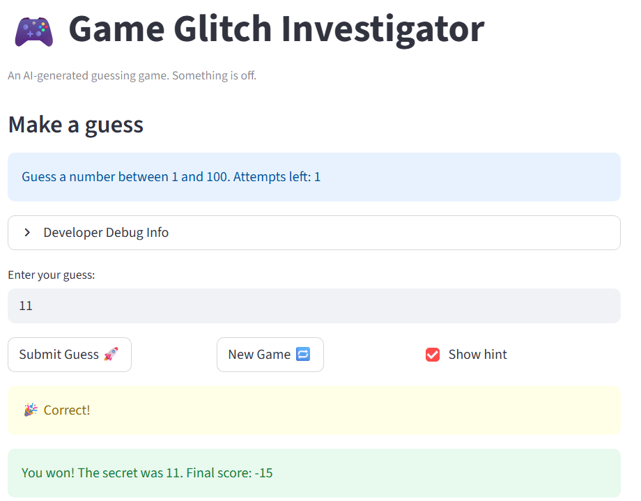

# 🎮 Game Glitch Investigator: The Impossible Guesser

## 🚨 The Situation

You asked an AI to build a simple "Number Guessing Game" using Streamlit.
It wrote the code, ran away, and now the game is unplayable. 

- You can't win.
- The hints lie to you.
- The secret number seems to have commitment issues.

## 🛠️ Setup

1. Install dependencies: `pip install -r requirements.txt`
2. Run the broken app: `python -m streamlit run app.py`

## 🕵️‍♂️ Your Mission

1. **Play the game.** Open the "Developer Debug Info" tab in the app to see the secret number. Try to win.
2. **Find the State Bug.** Why does the secret number change every time you click "Submit"? Ask ChatGPT: *"How do I keep a variable from resetting in Streamlit when I click a button?"*
3. **Fix the Logic.** The hints ("Higher/Lower") are wrong. Fix them.
4. **Refactor & Test.** - Move the logic into `logic_utils.py`.
   - Run `pytest` in your terminal.
   - Keep fixing until all tests pass!

## 📝 Document Your Experience

**Game Purpose:** Glitchy Guesser" is the classic number-guessing game. A user tries to find the secret number within a limited number of guesses, based on the difficulty level they choose.

- **Bugs & Fixes:**
1. New Game Logic: While the "New Game" button resets the secret number and guess attempts, it does not clear the player's history or status, and thus the new game crashes/ends immediately. I made sure that when "New Game" is pressed, all relevant session state variables are reset so that the new game does not crash.

2. Hint Flip: The logic for the check_guess function was reversed. It tells the player to guess higher when their guess is actually too high and lower when it is too low. Basically, it deceives the user. I swapped this logic to ensure the hints actually help the user make progress towards guessing the right number.

3. Range Boundary Check: The parse_guess function only checks if the input is a valid number. It allows users to submit numbers outside the valid guess range [1,100]. I added an input check that will notify the user that their guess is outside the specified range.

## 📸 Demo

## 🚀 Stretch Features
- [ ] [If you choose to complete Challenge 4, insert a screenshot of your Enhanced Game UI here]
